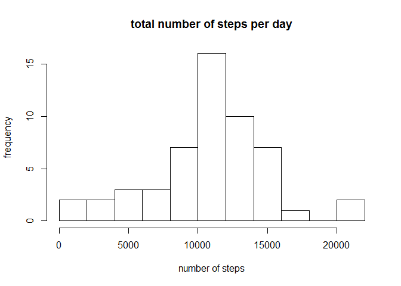
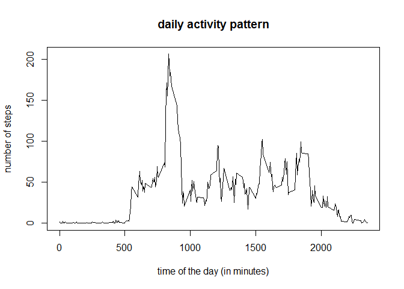
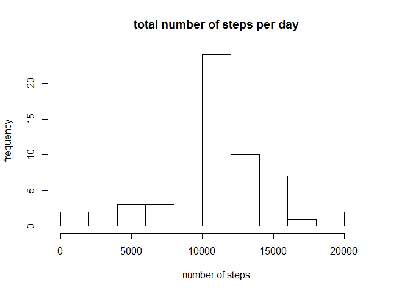
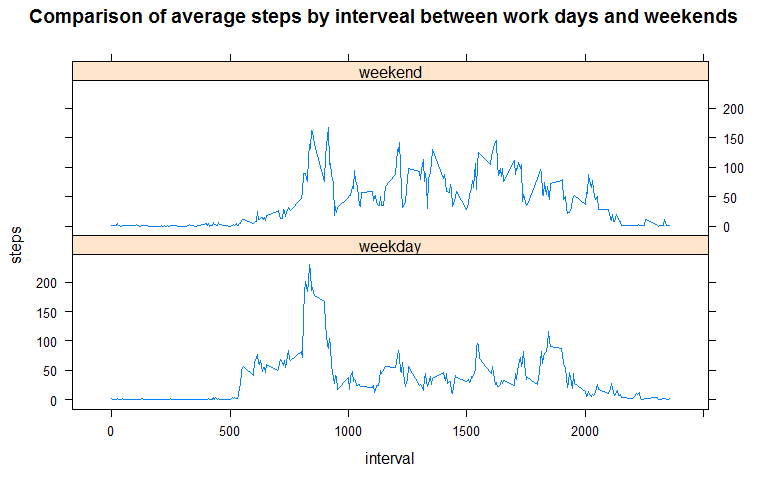

# Reproducible Research: Peer Assessment 1


## Loading and preprocessing the data


```r
activity<- read.csv("activity.csv")
activity$date<-as.Date(activity$date)
```

## What is mean total number of steps taken per day?

```r
aggActivity <- aggregate(steps ~ date, activity, sum)

hist(aggActivity$steps, ylab  = "frequency", main="total number of steps per day", xlab="number of steps", breaks=10)
```

 

Mean of steps per day:

```r
meanOfStepsPerDay <-mean(aggActivity$steps)
```

```
## [1] 10766.19
```
Median of steps per day:

```r
medianOfStepsPerDay <- median(aggActivity$steps)
```

```
## [1] 10765
```
## What is the average daily activity pattern?

```r
intervalActivity <- aggregate(steps ~ interval, activity, mean)
plot(intervalActivity$interval, intervalActivity$steps, type="l",xlab="time of the day (in minutes)", ylab="number of steps", main= "daily activity pattern")
```

 

###Interval with the most number of steps:

```r
maxInterval <-intervalActivity$interval[which(intervalActivity$steps==max(intervalActivity$steps))]
maxInterval
```

```
## [1] 835
```


## Imputing missing values
number of missing values:

```r
nrow(activity[is.na(activity$steps),])
```

```
## [1] 2304
```
Repacing the missing values by the mean for that interval:

```r
cleanedActivity <-activity
for(i in 1:nrow(activity)){
    if(is.na(activity$steps[i])){
        cleanedActivity$steps[i]<-intervalActivity$steps[which(intervalActivity$interval==activity$interval[i])]
    }
}

CleanedaggActivity <- aggregate(steps ~ date, cleanedActivity, sum)

hist(CleanedaggActivity$steps, ylab  = "frequency", main="total number of steps per day", xlab="number of steps", breaks=10)
```

 

Mean of steps per day for cleaned data:

```r
CleanedmeanOfStepsPerDay <-mean(CleanedaggActivity$steps)
```

```
## [1] 10766.19
```
Median of steps per day for cleaned data:

```r
CleanedmedianOfStepsPerDay <- median(CleanedaggActivity$steps)
```

```
## [1] 10766.19
```

Because the missing values have been replaced by the mean for that interval, the total mean per day doesn't change but the median is closer to the mean.

## Are there differences in activity patterns between weekdays and weekends?
Sorting which dates are weekdays and which are weekend:

```r
cleanedActivity$weekday <- weekdays(cleanedActivity$date)
cleanedActivity$weekend[cleanedActivity$weekday %in% c("Saturday","Sunday")]<-"weekend"
cleanedActivity$weekend[!(cleanedActivity$weekday %in% c("Saturday","Sunday"))]<-"weekday"
cleanedActivity$weekend <- factor(cleanedActivity$weekend)
```
Getting the average by interval for weekdays and weekends:

```r
WeekendintervalActivity <- aggregate(steps ~ interval, cleanedActivity[cleanedActivity$weekend=="weekend",], mean)
WeekendintervalActivity$weekend<-"weekend"
WeekintervalActivity <- aggregate(steps ~ interval, cleanedActivity[cleanedActivity$weekend=="weekday",], mean)
WeekintervalActivity$weekend<-"weekday"
weekIntervals<- rbind(WeekintervalActivity,WeekendintervalActivity)
weekIntervals$weekend <- factor(weekIntervals$weekend)
```

```r
library(lattice)

xyplot(steps ~ interval|weekend, data=weekIntervals, layout=c(1,2),type="l",main="Comparison of average steps by interveal between work days and weekends")
```

 
